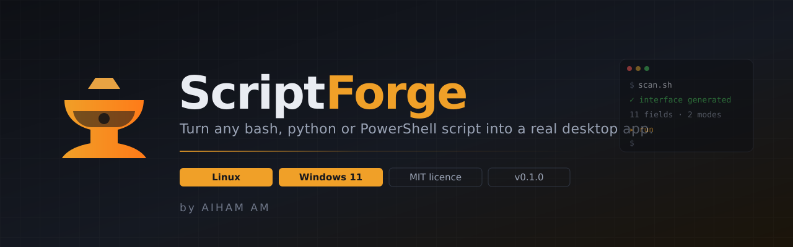
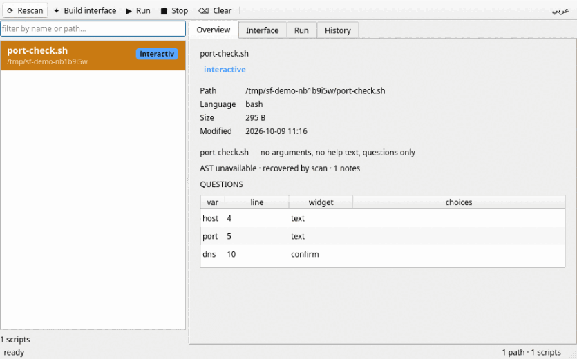

<div align="center">



# ScriptForge

**Point it at a shell script. It reads the questions the script was never told
to document, and gives you a window instead of a prompt.**

[](https://github.com/aihams21/scriptforge/releases/latest)
[](#licence)
[](https://www.python.org/downloads/)
[](https://github.com/aihams21/scriptforge/releases/latest)
[](https://github.com/aihams21/scriptforge/releases/latest)
[](#tests)
[](LICENSE)

[](https://codespaces.new/aihams21/scriptforge?quickstart=1)
[](https://github.com/aihams21/scriptforge/network/members)
[](https://github.com/aihams21/scriptforge)

</div>

<div align="center">

### Download

[](https://github.com/aihams21/scriptforge/releases/latest/download/ScriptForge-linux.tar.gz)
[](https://github.com/aihams21/scriptforge/releases/latest/download/ScriptForge-windows.zip)
[](https://github.com/aihams21/scriptforge/releases/latest)

`v0.1.0` · no account, no telemetry, no network calls

</div>

---

## Install

<details open>
<summary><b>Linux — one line</b></summary>

```bash
curl -fsSL https://raw.githubusercontent.com/aihams21/scriptforge/main/install.sh | bash
```

Installs the Qt/xcb runtime through `apt`, builds a virtualenv under
`~/.local/share/scriptforge`, links `scriptforge` into `~/.local/bin`, adds a
desktop icon and runs a self-test. Re-running it is safe.

Add `--gui` if the window is the only thing you want (skips the terminal UI
dependencies):

```bash
curl -fsSL https://raw.githubusercontent.com/aihams21/scriptforge/main/install.sh | bash -s -- --gui
```

</details>

<details>
<summary><b>Windows 11 — one line</b></summary>

Open PowerShell (**not** cmd) and paste:

```powershell
iex ((New-Object System.Net.WebClient).DownloadString('https://raw.githubusercontent.com/aihams21/scriptforge/main/install.ps1'))
```

Creates an isolated venv under `%LOCALAPPDATA%\ScriptForge`, installs the
package, writes Start-menu and Desktop shortcuts, self-tests, and opens the
window.

</details>

<details>
<summary><b>From the downloaded archive</b></summary>

```bash
tar -xzf ScriptForge-linux.tar.gz && cd ScriptForge-linux && ./install.sh --gui
```

```powershell
Expand-Archive .\ScriptForge-windows.zip; cd .\ScriptForge-windows; .\install.ps1
```

</details>

<details>
<summary><b>Try it without installing</b></summary>

[](https://codespaces.new/aihams21/scriptforge?quickstart=1)

The devcontainer provisions the venv, the Qt libraries and an X virtual frame.
In an X11-capable workspace the window runs under `xvfb-run -a .venv/bin/python
-m scriptforge.cli gui`.

</details>

---

## What it does

A script with no help text is still a program with an interface — it just hides
it in `read` statements. ScriptForge recovers that interface and builds a
window around it.

```bash
#!/bin/bash
echo "== netcheck =="
read -rp "target host: " host
read -rp "port [443]: " port
read -rp "resolve DNS first? [y/N] " dns
echo "connecting to $host:$port"
```

```
┌─ ScriptForge ───────────────────────────────────────────┐
│ ▸ port-check.sh              interactive                │
├──────────────────────┬──────────────────────────────────┤
│  target host:        │  [ 10.0.0.5                  ]  │
│  port [443]:         │  [ 8443                       ]  │
│  resolve DNS [y/N]:  │  [x] use this script            │
├──────────────────────┴──────────────────────────────────┤
│ == netcheck ==                                          │
│ target host: port [443]: unusual port                   │
│ connecting to 10.0.0.5:8443                             │
│ finished · 0 · 1.1s                                     │
└─────────────────────────────────────────────────────────┘
```

The original file is never modified. Forged wrappers, when needed, land in
`~/.scriptforge/built/`.

<details>
<summary><b>The demo, end to end (11 s)</b></summary>



Recorded from the real window by `packaging/make-demo-gif.py`, so it cannot drift
from what the app does.

</details>

---

## How it works

<details>
<summary><b>Architecture</b></summary>

```
   script.sh
       │
       ▼
 ┌─────────────┐   bashlex AST   → PromptSite / ArgSpec / FlagSpec
 │   parser    │   (regex scan as fallback)
 └─────────────┘
       │
       ▼
 ┌─────────────┐   one ScriptIR per script, shared by every front end
 │  ScriptIR   │
 └─────────────┘
       │
       ├──► rewriter ──► ~/.scriptforge/built/script-forge-<name>   (originals untouched)
       │
       ├──► Qt window   ──► form widgets built straight from PromptSite
       │
       ├──► terminal UI ──► same IR, rendered as Textual widgets
       │
       └──► runner      ──► pexpect PTY, answers injected per prompt
```

Four adapters cover bash, python, PowerShell and batch. Each produces the same
`ScriptIR`, so a `.ps1` with `Read-Host` and a `.sh` with `read -rp` reach the
window through identical code.

</details>

<details>
<summary><b>Intermediate representation</b></summary>

`ScriptIR` is the contract. Front ends never parse a script themselves.

| Field | Meaning |
|---|---|
| `kind` | `interactive`, `parametric`, `skeletal`, `fullscreen`, `opaque` |
| `lang` | `bash`, `python`, `powershell`, `batch` |
| `prompt_sites` | line, variable, prompt text, widget hint, choices, default |
| `positional_args` | indexed arguments with help text |
| `flags` | short/long, takes-value, help |
| `subcommands` | `case` branches, `add_parser` subcommands, `%1` dispatch |
| `output_hints` | detected tools (nmap, sqlmap, …) and expected shape |
| `parse_mode` | `ast` or `scan`, recorded so the UI can say how it read the file |

`Kind` decides treatment:

| Kind | Meaning | What ScriptForge does |
|---|---|---|
| `interactive` | asks questions mid-run | form + PTY with answers injected |
| `parametric` | subcommands and flags | form + argv assembly |
| `skeletal` | no discoverable interface | rewriter builds a menu wrapper |
| `fullscreen` | curses / TUI | raw PTY, keyboard passthrough |
| `opaque` | delegates to another program | freeform argv box |

</details>

<details>
<summary><b>Script examples it handles</b></summary>

```bash
# interactive — read / read -p / read -rp / $'...' prompts
read -rp "target host: " host
read -rp "port [443]: " port

# parametric — getopts
while getopts ":hvp:" opt; do
  case $opt in
    h) usage ;;
    v) verbose=1 ;;
    p) port=$OPTARG ;;
  esac
done

# subcommands — case
case "$1" in
  start)  start_server ;;
  stop)   stop_server  ;;
  status) show_status   ;;
esac
```

```python
# python — argparse
parser = argparse.ArgumentParser(description="scan a subnet")
parser.add_argument("target", help="CIDR range")
parser.add_argument("-p", "--ports", default="22,80,443")
parser.add_argument("-v", "--verbose", action="store_true")
```

```powershell
# powershell — param() and Read-Host
param([string]$Target, [int]$Port = 443)
$Target = Read-Host "target host"
$Port   = Read-Host "port"
```

```batch
@echo off
set /p TARGET=target host:
set /p PORT=port:
```

</details>

<details>
<summary><b>Answering prompts over a PTY</b></summary>

`read -rp "q: "` writes its prompt with **no trailing newline**, so a
line-oriented driver cannot work: there is nothing to split on. The runner
watches the buffer tail for a prompt-shaped regex and answers it, falling back
to idle-tick detection for prompts that print nothing.

Three details that are easy to get wrong and are covered by tests:

- **EOF, once per prompt.** Ctrl-D only closes a `read` while the input buffer
  is empty. A script with three prompts and two answers needs three of them, or
  it blocks in `read` until the run timeout. Same contract as `bash < answers`.
- **The matched text lands in `after`, not `before`.** The prompt regex is
  anchored to the end of the buffer, so it consumes everything and `before` is
  empty — capturing only `before` silently drops every prompt from the console.
- **Drain after exit.** A child that dies during a timeout tick has output left
  in the pty buffer; reading it after the loop is what keeps the last line.

</details>

<details>
<summary><b>Why Qt</b></summary>

The same code has to open a window on bare-metal Kali, Kali in a VM, and
Windows 11. That rules out GTK (no first-class Windows story without a
separate toolchain) and a web view (a browser-based "desktop app" is a web app
with extra steps).

PySide6 ships identical binaries on all three, is installed by `pip`, and runs
headless under `QT_QPA_PLATFORM=offscreen` — which is how the whole window is
tested in CI without an X server.

The terminal UI stays because it is faster over SSH, where a GUI has no place.

</details>

<details>
<summary><b>Safety boundaries</b></summary>

- Your scripts are never modified. Everything is read-only analysis plus a
  generated copy in `~/.scriptforge/built/`.
- Parsing is bounded: 5000 lines, 1 MB, 5 seconds per file. A runaway or
  binary file is skipped, not hung on.
- Run history goes to a local SQLite file. Nothing is uploaded.
- The window listens to nothing; there is no server and no open port.

</details>

---

## Commands

| Command | What it does |
|---|---|
| `scriptforge` | open the window |
| `scriptforge gui --lang ar` | open it in Arabic |
| `scriptforge tui` | terminal interface |
| `scriptforge inspect <script>` | print the recovered interface |
| `scriptforge inspect <script> --json` | the same, as IR |
| `scriptforge plan <script>` | what forging would change |
| `scriptforge forge <script>` | generate a wrapper for a UI-less script |
| `scriptforge run <script> --answers k=v` | run headless |
| `scriptforge scan <dir>` | classify a directory |
| `scriptforge history` | recent runs |

---

## Features

- **Desktop window** on Linux and Windows 11 from one code path
- **Arabic and English** from a toolbar button; Arabic switches the whole layout to RTL
- **y/N prompts render as a choice** with the bracket default honoured (`[y/N]` starts at no)
- **Optional fields fold away** so a 200-field script is not a wall of inputs
- **Four languages** parsed: bash, python, PowerShell, batch
- **Live output** streamed into the window while a script runs
- **Run history** in a local SQLite vault
- **Search** across every scanned script
- **Never modifies your scripts**
- **Terminal UI** for SSH sessions
- **One-line installers** for both platforms

## Limits

- **No PTY on Windows.** `prompt injection needs a pty, so Windows runs pipes and cannot answer prompts mid-run. Form answers are passed as arguments instead.
- **Pattern matching, not full semantics.** Recovery reads prompts from ASTs and a scanner; a script that computes its prompt text at runtime is classified but not fully modelled.
- **Full-screen TUIs are passed through raw.** curses and similar are given a PTY with no widget generation.
- **Qt is an optional extra.** `pip install scriptforge` gets the CLI and terminal UI; the window needs `pip install "scriptforge[gui]"`.
- **`forkpty()` runs from a worker thread on repeat runs.** Python 3.14 warns it can deadlock the child. The first run forks on the main thread; later runs may warn. Not observed in practice, not proven safe.

---

## Tests

```
91 passed
```

The window is tested headless under `QT_QPA_PLATFORM=offscreen`, which is the
same no-TTY path a `.desktop` launch takes — the condition that produced the
original "the app closes itself" report.

```bash
.venv/bin/python -m pytest tests/ -q
.venv/bin/python tests/crash_hunt.py     # sweeps every key in four UI states
```

---

## Contributing

Issues and pull requests welcome. Useful first steps:

- `fix(parser): <what> for <which shell>`
- `feat(gui): <what>`
- `test(runner): <which edge case>`

Run the suite before opening a PR.

<a href="https://github.com/aihams21/scriptforge">
  
</a>

---

## Licence

MIT. See [LICENSE](LICENSE).